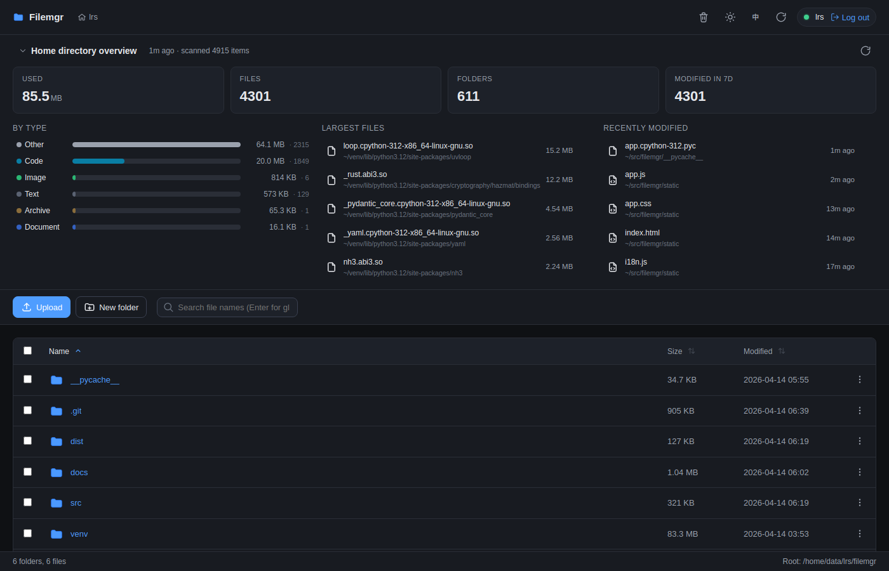
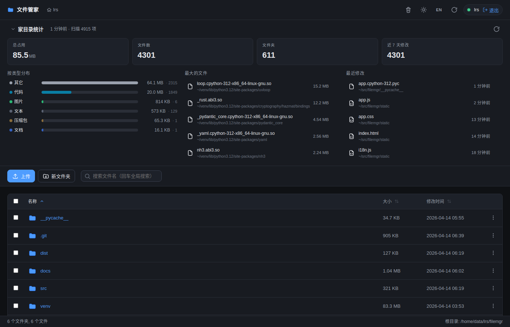
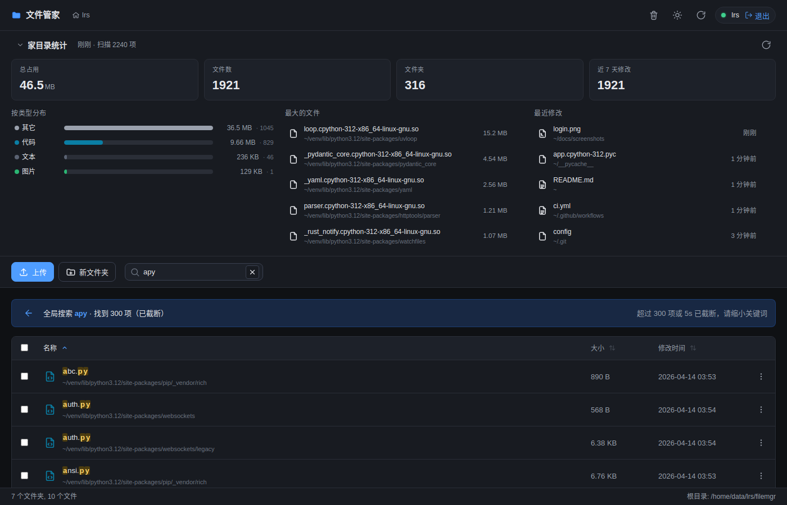
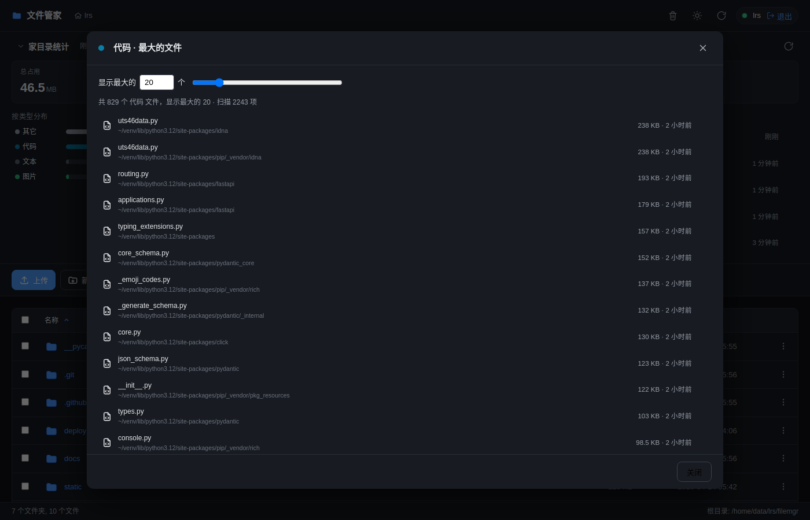
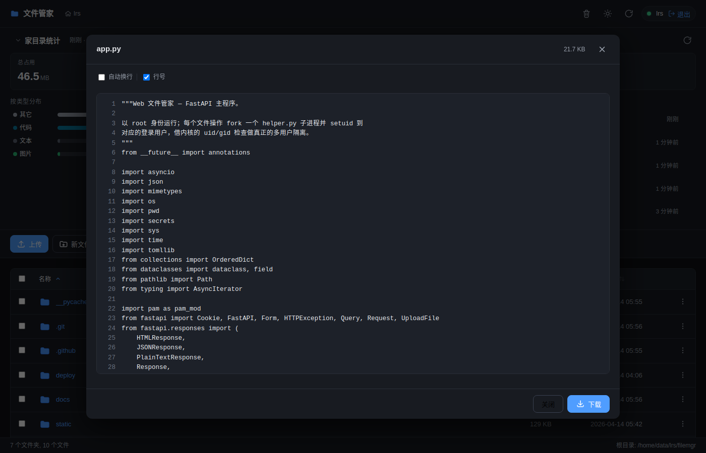
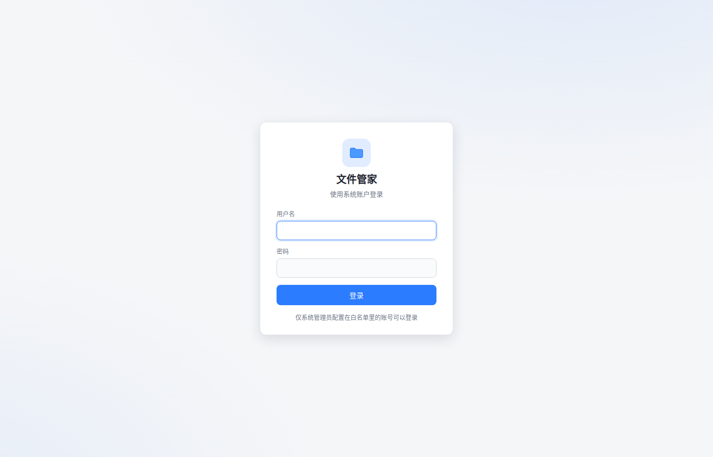

# filemgr

[](https://pypi.org/project/filemgr/)
[](LICENSE)
[](https://www.python.org/downloads/)

A lightweight, multi-user web file manager for Linux servers with **real PAM
authentication and per-user privilege isolation**. Each login performs
filesystem operations through a `setuid`-dropped child process, so access
control is enforced by the kernel — two users using the same tool at the same
time cannot see or touch each other's files unless the filesystem permissions
allow it.

Extra batteries for **bioinformatics workflows**: recognizes FASTQ / BAM /
VCF / GFF / BED / H5AD / RData / ipynb / SIF and more, with transparent
`.gz` preview.

## Features

### Core
- **PAM login** against real system accounts (with a configurable whitelist)
- **Multi-user isolation** via `setuid` per request (service runs as root, work
  happens as the logged-in user's uid)
- **Browse, upload, download, rename, delete, mkdir** with keyboard shortcuts,
  drag-and-drop, and right-click context menus
- **Sortable list** with sticky headers and `aria-sort`; sort by name / size /
  modified time
- **Fuzzy search** (VS Code-style subsequence scoring): typing filters the
  current folder instantly; Enter searches the current subtree recursively
  with match highlighting

### File operations
- **Folder upload** via dedicated button or just drag-dropping a directory
  from the OS (recurses via `webkitGetAsEntry`)
- **New text file** from the toolbar; empty file written via the helper
- **Inline text editing** — text preview has an Edit button that swaps into
  a textarea; Save atomically writes via `write_stream` (disabled for
  truncated or gzipped previews to avoid silent data loss)
- **Drag-to-move** rows onto folder rows to rename/move them across
  directories
- **Batch `tar` download** — select multiple items and stream a `.tar`
  archive, built by the helper's privilege-dropped `tar` with a
  null-separated file list on stdin (works past `ARG_MAX`)

### Previews
- Text, code, images, video, audio, PDF — with touchpad pinch and keyboard
  zoom for images
- **Transparent gunzip preview** for `.fastq.gz`, `.vcf.gz`, `.fa.gz`,
  `.bed.gz`, and other compressed text files
- **Image thumbnails** in the file list (opt-in: `pip install
  filemgr[thumbnails]`) — helper generates via Pillow and caches per-user
  under `~/.filemgr-thumbs/`, served with ETag + `Cache-Control`

### Statistics panel
- Total usage, file count, folder count, recent-7-days modifications
- Breakdown by type with bio-aware categories (sequencing / variants /
  reference / matrix / rdata / notebook / container / ...)
- Top-N largest files + most-recently-modified files
- Click any type to drill into a Top-N-by-type modal with adjustable N
- **Live streaming**: both the panel and the Top-N modal consume ndjson
  from `/api/stats_stream` / `/api/top_by_type_stream`, updating as the
  walker scans. Numbers ease smoothly (rAF tween), new Top-N entrants
  slide in via FLIP, a shimmer line under the header signals "still
  scanning". Size totals match `du -sh` (disk usage, not apparent size).

### Recycle bin
- Delete is a soft move to `~/.filemgr-trash`; toast shows a 7-second
  "Undo" button
- Recycle-bin modal lists every entry with remaining time before
  auto-purge, per-item "Restore" / "Permanently delete", and an "Empty
  recycle bin" button
- Items older than `trash_retention_days` (default 3) are purged
  opportunistically whenever `trash_list` or `delete` is called — no
  cron / timer needed

### Transfer panel
- Progress bar, live speed, ETA, cancel button for every upload and
  download (including batch downloads)
- **HTTP Range** support for video/audio scrubbing and resumable downloads

### URL & navigation
- **URL deep linking** — current directory and search state live in the
  hash, so refresh / share / back-button all just work
- **List virtualization** kicks in automatically above 500 files per
  directory so huge home dirs stay smooth

### Accessibility & UX
- `aria-label` on icon buttons, `focus-visible` outlines, `aria-live="polite"`
  toasts, full keyboard navigation on rows
  (`Enter` / `Space` / `Delete` / `F2` / `Shift+F10` / `ContextMenu`),
  `prefers-reduced-motion` support
- **Dark mode** follows `prefers-color-scheme` by default with a manual
  top-bar toggle
- **i18n** (English + 简体中文) follows `navigator.language` with an `EN/中`
  toggle
- **Password show/hide** button on the login form
- **404/500** for non-API paths falls back to the SPA so bookmarked deep
  URLs just work

### Ops
- **Audit log** — every mutation (mkdir / rename / trash / restore / purge /
  write) appends a 0600 JSONL line to `~/.filemgr-audit.log`
- **`SIGHUP` hot reload** of `config.toml` — `sudo systemctl reload filemgr`
  picks up whitelist changes without restarting the process

## Screenshots

<table>
  <tr>
    <td width="50%"><br/><sub><b>English UI (dark theme)</b> — stats panel up top, sortable file list below. Switch via the EN/中 button in the top bar.</sub></td>
    <td width="50%"><br/><sub><b>中文 UI</b> — same view, different language. Preference persists in localStorage.</sub></td>
  </tr>
  <tr>
    <td width="50%"><br/><sub><b>Fuzzy search</b> — subsequence matching with score-ranked results and match highlighting.</sub></td>
    <td width="50%"><br/><sub><b>Top-N by type</b> — click any category in the stats panel to see its largest files; N is adjustable.</sub></td>
  </tr>
  <tr>
    <td width="50%"><br/><sub><b>Text preview</b> — line numbers, word-wrap toggle, 1 MB cap; transparent <code>.gz</code> decompression for bio formats.</sub></td>
    <td width="50%"><br/><sub><b>Login</b> — PAM auth against real system accounts on a whitelist.</sub></td>
  </tr>
</table>

## How it works

```
┌───────────────────────────────┐        ┌────────────────────────────┐
│ Browser                       │  HTTPS │ uvicorn + FastAPI (root)   │
│  - cookie session             │◀──────▶│  - PAM auth                │
│  - no mutation of fs directly │        │  - per-request helper.py   │
└───────────────────────────────┘        │    subprocess:             │
                                         │    initgroups/setgid/setuid│
                                         │    to the logged-in user   │
                                         │    → os.scandir/open/...   │
                                         └──────────┬─────────────────┘
                                                    │ kernel-enforced
                                                    ▼ permissions
                                              /home/data/zrx/...
```

- `app.py` runs as **root** (via systemd) so it can drop privileges for each
  request.
- Every filesystem operation is executed by spawning `helper.py` with args
  `--uid --gid --home …` and a sub-command (`list`, `stat`, `dirsize`,
  `read_stream`, `write_stream`, `mkdir`, `rename`, `delete`, `search`,
  `stats`, `stats_stream`, `top_by_type`, `top_by_type_stream`, `thumbnail`,
  `tar_stream`, `trash_*`). The helper **drops privileges immediately** via
  `os.setgroups([]) / os.initgroups / os.setgid / os.setuid`, then does the
  work.
- The `*_stream` sub-commands emit ndjson one line at a time and
  `sys.stdout.flush()` per event; `StreamingResponse` forwards the pipe to
  the browser, which consumes it via `ReadableStream` + `requestAnimationFrame`.
- A small per-session `stat` cache plus HTTP ETag / `Cache-Control` on media
  previews keeps typical browsing snappy without sacrificing isolation.

## Prerequisites

- Linux with `systemd`
- Python 3.11+ (uses `tomllib`; tested on 3.12)
- `libpam0g-dev` headers (Debian/Ubuntu) to build the `python-pam` wheel
- A PAM service on the host (usually already present — `login`,
  `common-auth`, `passwd`, and `sshd` are auto-tried as fallbacks)
- Root on the host (the service and `setuid` require it)

## Install & run

```bash
# 1. Install. A virtualenv avoids fighting Debian's PEP 668 protection.
python3 -m venv /opt/filemgr-venv
/opt/filemgr-venv/bin/pip install filemgr
# or, with image thumbnails enabled (Pillow):
/opt/filemgr-venv/bin/pip install 'filemgr[thumbnails]'

# 2. One-shot: generate config with every local account whitelisted,
#    install the systemd unit, enable and start it.
sudo /opt/filemgr-venv/bin/filemgr quickstart
```

That's it — `quickstart` prints the URL. Open it, log in with any system
account's password.

To limit who can sign in, pass `--users` (comma-separated) instead of
whitelisting everyone:

```bash
sudo /opt/filemgr-venv/bin/filemgr quickstart --users alice,bob,carol
```

If you'd rather wire it up by hand:

```bash
sudo filemgr init-config /etc/filemgr/config.toml --all-users
sudo $EDITOR /etc/filemgr/config.toml      # optional: prune users
sudo filemgr install-service --config /etc/filemgr/config.toml
sudo systemctl enable --now filemgr
```

Or, to try it quickly without systemd:

```bash
sudo /opt/filemgr-venv/bin/filemgr run --config /etc/filemgr/config.toml
```

The `filemgr` CLI exposes:

| Command                                   | What it does                                               |
|-------------------------------------------|------------------------------------------------------------|
| `filemgr quickstart [--users A,B,C]`      | One-shot: write config, install systemd unit, start (root) |
| `filemgr run [--config PATH]`             | Run the server in the foreground                           |
| `filemgr init-config [PATH] [--all-users] [--users A,B,C]` | Write a sample config.toml (optionally pre-fill whitelist) |
| `filemgr install-service [--config PATH]` | Generate and install the systemd unit (root)               |
| `filemgr uninstall-service`               | Remove the systemd unit                                    |
| `filemgr status`                          | `systemctl status filemgr`                                 |
| `filemgr logs [-f] [-n N]`                | `journalctl -u filemgr`                                    |
| `filemgr --version`                       | Print the version                                          |

Config file is discovered in this order: `--config` → `$FILEMGR_CONFIG` →
`./config.toml` → `~/.config/filemgr/config.toml` → `/etc/filemgr/config.toml`.

Open `http://<your-server>:8765` in a browser — `listen_host` defaults to
`0.0.0.0`, so any LAN machine can reach it once the port is open. To lock
it down to the host, set `listen_host = "127.0.0.1"` and use an SSH tunnel:

```bash
ssh -L 8765:127.0.0.1:8765 you@server
```

For public deployments, put nginx/Caddy in front for TLS. A sample nginx
block is at the end of this README.

### Development install

```bash
git clone https://github.com/Lings01/filemgr.git
cd filemgr
python3 -m venv venv
./venv/bin/pip install -e .
./venv/bin/filemgr init-config ./config.toml
./venv/bin/filemgr run
```

## Configuration (`config.toml`)

```toml
listen_host = "0.0.0.0"              # bind on all interfaces (LAN-reachable)
listen_port = 8765
session_ttl_seconds = 28800          # 8 h
max_upload_bytes = 10_737_418_240    # 10 GiB
dirsize_max_files = 100_000          # per-folder size cap; 0 = unlimited
dirsize_timeout_seconds = 30         # 0 = unlimited
stats_max_files = 0                  # home-directory-wide stats cap; 0 = unlimited
stats_timeout_seconds = 0            # 0 = unlimited
preview_text_max_bytes = 1_048_576   # 1 MiB
pam_service = "login"
trash_retention_days = 3

[[users]]
name = "alice"
root = "/home/alice"
```

- `pam_service`: the PAM service name used for authentication. If the primary
  value fails, `common-auth`, `passwd`, and `sshd` are tried as fallbacks.
- `[[users]]`: repeatable block. `name` must exist as a system account; `root`
  is the starting directory a user sees after login (defaults to their
  passwd-entry home).
- `stats_max_files` / `stats_timeout_seconds` at 0 let the streaming stats
  panel scan the whole home; set a cap if scans are too expensive.

After editing, `sudo systemctl reload filemgr` hot-reloads the config via
SIGHUP without restarting — the service writes a one-line log to journald
confirming success or failure.

## Keyboard shortcuts

| Key                       | Action                                         |
|---------------------------|------------------------------------------------|
| `/` or `Ctrl+F`           | Focus the search box                           |
| `Enter` (in search)       | Search the current subtree recursively         |
| `Esc` (in search)         | Clear search, return to the current directory  |
| `R`                       | Refresh the current directory                  |
| `Backspace`               | Go up one level                                |
| `Enter` (on a row)        | Open: enter folder / preview file              |
| `Space` (on a row)        | Toggle selection                               |
| `Delete`                  | Move selected to recycle bin                   |
| `F2`                      | Rename the selected item                       |
| `Shift+F10` / ContextMenu | Open the row action menu                       |
| `Ctrl+wheel` / pinch      | Zoom (image preview; also works in PDF viewer) |
| `+` / `-` / `0` / `1`     | Image preview: zoom in / out / fit / 1:1       |

## Security model

1. **Authentication** is delegated to PAM via `python-pam`. Failed logins pay a
   fixed 1-second penalty to resist brute force. Only accounts listed in
   `[[users]]` can authenticate, even if PAM would accept other users.
2. **Authorization** is enforced by the kernel. `app.py` forks a helper
   subprocess and the helper calls `setgroups([]) / initgroups / setgid /
   setuid` to the logged-in uid/gid **before touching the filesystem**. Read,
   write, and traversal permissions are then whatever Linux says they are.
3. **Path validation** in the helper rejects paths that escape the configured
   home root (via symlinks or `..`). This is a UX guard; the kernel is still
   the ground truth.
4. **Session tokens** are 256-bit `secrets.token_urlsafe`, stored server-side
   in memory. Cookies are `HttpOnly` + `SameSite=Strict`.
5. **The service must run as root.** This is required to drop privileges per
   request. Running as a non-root user means filesystem operations fail.

## Recycle bin

Soft deletes move the file or folder to `~/.filemgr-trash/{id}__{name}` and
write a sidecar JSON under `~/.filemgr-trash/.meta/{id}.json` with the
original path and deletion timestamp.

- The toast after a successful delete shows an "Undo" button for 7 seconds.
- A recycle-bin modal (top-bar button) lists every entry, with remaining time
  before auto-purge, per-item "Restore" / "Permanently delete", and an
  "Empty recycle bin" button.
- Auto-purge happens opportunistically on every `trash_list` call and on
  every `delete` call — no cron / systemd timer needed.

## Project layout

```
filemgr/
├── pyproject.toml              Package + entry point definition
├── README.md
├── LICENSE
├── src/
│   └── filemgr/
│       ├── __init__.py
│       ├── app.py              FastAPI app: endpoints, session, PAM, helper RPC
│       ├── helper.py           Setuid child process; all filesystem ops live here
│       ├── cli.py              `filemgr` CLI entry point
│       ├── static/             Single-page frontend (vanilla HTML/CSS/JS)
│       │   ├── index.html
│       │   ├── app.js
│       │   ├── app.css
│       │   └── i18n.js          Translation table + t() / setLang()
│       └── templates/
│           ├── config.toml.example
│           └── filemgr.service  systemd unit (filled in at install-service)
└── docs/screenshots/
```

## Optional: nginx reverse proxy (HTTPS)

```nginx
server {
    listen 443 ssl http2;
    server_name files.example.com;

    ssl_certificate     /etc/letsencrypt/live/files.example.com/fullchain.pem;
    ssl_certificate_key /etc/letsencrypt/live/files.example.com/privkey.pem;

    client_max_body_size 10G;
    proxy_request_buffering off;   # stream uploads
    proxy_buffering off;           # stream downloads
    proxy_read_timeout 3600s;
    proxy_send_timeout 3600s;

    location / {
        proxy_pass http://127.0.0.1:8765;
        proxy_set_header Host $host;
        proxy_set_header X-Forwarded-For  $remote_addr;
        proxy_set_header X-Forwarded-Proto $scheme;
    }
}
```

## Non-goals

- Not a cloud storage service: no federation, no external auth, no sharing
  links to strangers.
- Not a full OS file manager replacement: no desktop icons, no mount
  management, no permission editor (use your shell).
- Not hardened against a malicious service operator: the service runs as root,
  so whoever controls the box controls the files anyway. The guarantees here
  are between end users of the same box, not against root.

## License

MIT — see [LICENSE](LICENSE).
