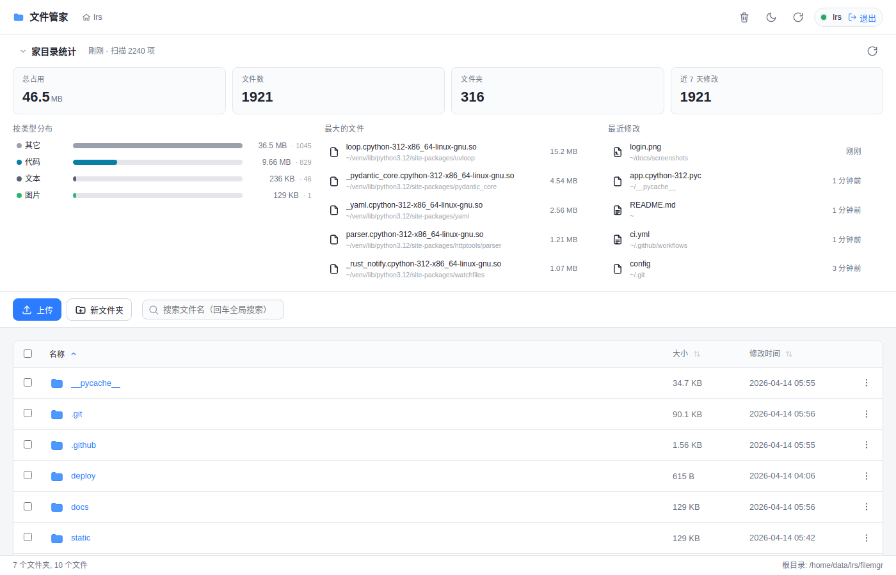
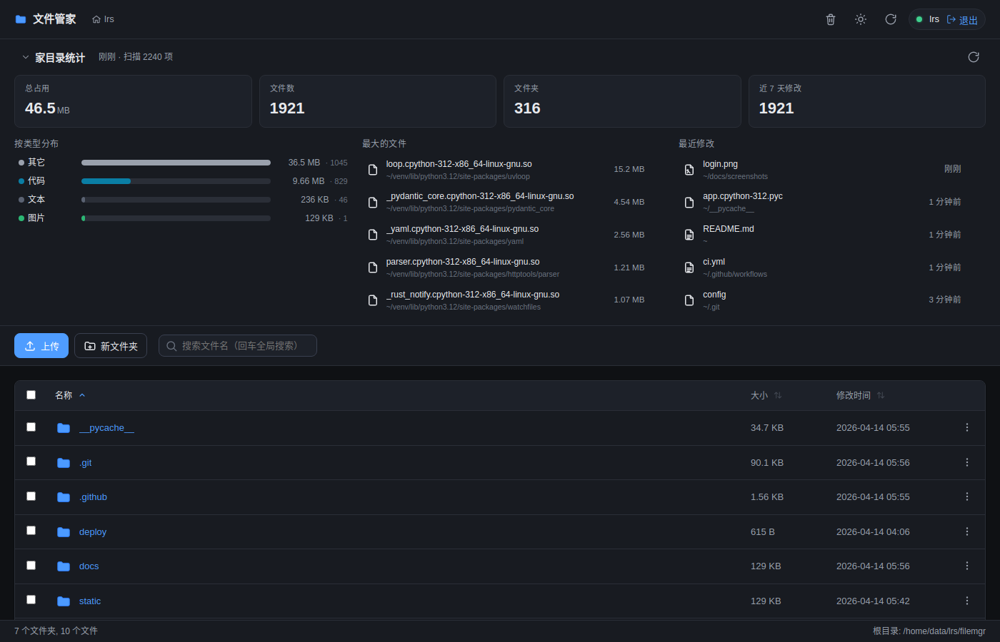

# filemgr

A lightweight, multi-user web file manager for Linux servers with **real PAM
authentication and per-user privilege isolation**. Each login performs
filesystem operations through a `setuid`-dropped child process, so access
control is enforced by the kernel — two users using the same tool at the same
time cannot see or touch each other's files unless the filesystem permissions
allow it.

Extra batteries for **bioinformatics workflows**: recognizes FASTQ / BAM /
VCF / GFF / BED / H5AD / RData / ipynb / SIF and more, with transparent
`.gz` preview.

## Features

- **PAM login** against real system accounts (with a configurable whitelist)
- **Multi-user isolation** via `setuid` per request (service runs as root, work
  happens as the logged-in user's uid)
- **Browse, upload, download, rename, delete, mkdir** with keyboard shortcuts,
  drag-and-drop, and right-click context menus
- **Sortable list** with sticky headers and `aria-sort`; sort by name / size /
  modified time
- **Fuzzy search** (VS Code-style subsequence scoring) — instant local filter
  in the current directory, Enter triggers a recursive global search from the
  home root with match highlighting
- **Previews** for text, code, images, video, audio, PDF; touchpad pinch and
  keyboard zoom for images; transparent gunzip preview for `.fastq.gz`,
  `.vcf.gz`, `.fa.gz`, `.bed.gz`, and other compressed text files
- **Folder sizes** computed recursively with a timeout + file-count cap to
  avoid runaway scans
- **Statistics panel** at the top of the page: total usage, file count, folder
  count, recent-7-days modifications, breakdown by type (with bio-aware
  categories), top-N largest files, most-recently-modified files; click any
  type to see top-N files of that type with an adjustable N
- **Recycle bin**: delete is a soft move to `~/.filemgr-trash`, toast shows an
  "Undo" button, a recycle-bin modal lists entries with remaining-time
  indicator, and items older than `trash_retention_days` (default 3) are
  auto-purged
- **Transfer panel** with progress bar, live speed, ETA, and cancel button
  (for uploads and downloads)
- **HTTP Range** support for video/audio scrubbing and resumable downloads
- **URL deep linking** — current directory and search state live in the URL
  hash, so refresh / share / back-button all just work
- **Accessibility**: `aria-label` on icon buttons, `focus-visible` outlines,
  `aria-live="polite"` toasts, keyboard navigation on rows
  (Enter / Space / Delete / F2 / Shift+F10 / ContextMenu), and
  `prefers-reduced-motion` support
- **Dark mode**: follows `prefers-color-scheme` by default, with a manual
  toggle in the top bar (persisted in `localStorage`)
- **List virtualization** kicks in automatically above 500 files per directory
  so huge home dirs stay smooth

## Screenshots

<table>
  <tr>
    <td width="50%"><br/><sub><b>Main view</b> — stats panel up top, sortable file list below.</sub></td>
    <td width="50%"><br/><sub><b>Dark mode</b> — follows the system theme, toggle persists in localStorage.</sub></td>
  </tr>
  <tr>
    <td width="50%"><br/><sub><b>Fuzzy search</b> — subsequence matching with score-ranked results and match highlighting.</sub></td>
    <td width="50%"><br/><sub><b>Top-N by type</b> — click any category in the stats panel to see its largest files; N is adjustable.</sub></td>
  </tr>
  <tr>
    <td width="50%"><br/><sub><b>Text preview</b> — line numbers, word-wrap toggle, 1 MB cap; transparent <code>.gz</code> decompression for bio formats.</sub></td>
    <td width="50%"><br/><sub><b>Login</b> — PAM auth against real system accounts on a whitelist.</sub></td>
  </tr>
</table>

## How it works

```
┌───────────────────────────────┐        ┌────────────────────────────┐
│ Browser                       │  HTTPS │ uvicorn + FastAPI (root)   │
│  - cookie session             │◀──────▶│  - PAM auth                │
│  - no mutation of fs directly │        │  - per-request helper.py   │
└───────────────────────────────┘        │    subprocess:             │
                                         │    initgroups/setgid/setuid│
                                         │    to the logged-in user   │
                                         │    → os.scandir/open/...   │
                                         └──────────┬─────────────────┘
                                                    │ kernel-enforced
                                                    ▼ permissions
                                              /home/data/zrx/...
```

- `app.py` runs as **root** (via systemd) so it can drop privileges for each
  request.
- Every filesystem operation is executed by spawning `helper.py` with args
  `--uid --gid --home …` and a sub-command (`list`, `stat`, `dirsize`, `read_stream`,
  `write_stream`, `mkdir`, `rename`, `delete`, `search`, `stats`, `top_by_type`,
  `trash_*`). The helper **drops privileges immediately** via
  `os.setgroups([]) / os.initgroups / os.setgid / os.setuid`, then does the work.
- A small per-session `stat` cache plus HTTP ETag / `Cache-Control` on media
  previews keeps typical browsing snappy without sacrificing isolation.

## Prerequisites

- Linux with `systemd`
- Python 3.11+ (uses `tomllib`; tested on 3.12)
- `libpam0g-dev` headers (Debian/Ubuntu) to build the `python-pam` wheel
- A PAM service on the host (usually already present — `login`,
  `common-auth`, `passwd`, and `sshd` are auto-tried as fallbacks)
- Root on the host (the service and `setuid` require it)

## Install & run

```bash
# 1. Install. A virtualenv is strongly recommended so pip doesn't fight
#    Debian's PEP 668 protection.
python3 -m venv /opt/filemgr-venv
/opt/filemgr-venv/bin/pip install git+https://github.com/Lings01/filemgr.git

# 2. Generate a config and edit the [[users]] whitelist.
sudo mkdir -p /etc/filemgr
sudo /opt/filemgr-venv/bin/filemgr init-config /etc/filemgr/config.toml
sudo $EDITOR /etc/filemgr/config.toml

# 3. Install and start the systemd unit.
sudo /opt/filemgr-venv/bin/filemgr install-service --config /etc/filemgr/config.toml
sudo systemctl enable --now filemgr
filemgr status
```

Or, to try it quickly without systemd (needs sudo for real setuid):

```bash
sudo /opt/filemgr-venv/bin/filemgr run --config /etc/filemgr/config.toml
```

The `filemgr` CLI exposes:

| Command                       | What it does                                               |
|-------------------------------|------------------------------------------------------------|
| `filemgr run`                 | Run the server in the foreground                           |
| `filemgr init-config [PATH]`  | Write a sample config.toml to `PATH` (default `./config.toml`) |
| `filemgr install-service`     | Generate and install the systemd unit (needs root)         |
| `filemgr uninstall-service`   | Remove the systemd unit                                    |
| `filemgr status`              | `systemctl status filemgr`                                 |
| `filemgr logs [-f] [-n N]`    | `journalctl -u filemgr`                                    |
| `filemgr version`             | Print the version                                          |

Config file is discovered in this order: `--config` → `$FILEMGR_CONFIG` →
`./config.toml` → `~/.config/filemgr/config.toml` → `/etc/filemgr/config.toml`.

Open `http://127.0.0.1:8765` (or your configured `listen_host:port`) in a
browser. For access from another machine, either change `listen_host` to
`0.0.0.0` and open a firewall port, or use an SSH tunnel:

```bash
ssh -L 8765:127.0.0.1:8765 you@server
```

For production, put nginx/Caddy in front for TLS. A sample nginx block is
included at the end of this README.

### Development install

```bash
git clone https://github.com/Lings01/filemgr.git
cd filemgr
python3 -m venv venv
./venv/bin/pip install -e .
./venv/bin/filemgr init-config ./config.toml
./venv/bin/filemgr run
```

## Configuration (`config.toml`)

```toml
listen_host = "127.0.0.1"
listen_port = 8765
session_ttl_seconds = 28800
max_upload_bytes = 10_737_418_240
dirsize_max_files = 100_000
dirsize_timeout_seconds = 30
preview_text_max_bytes = 1_048_576
pam_service = "login"
trash_retention_days = 3

[[users]]
name = "alice"
root = "/home/alice"
```

- `pam_service`: the PAM service name used for authentication. If the primary
  value fails, `common-auth`, `passwd`, and `sshd` are tried as fallbacks.
- `[[users]]`: repeatable block. `name` must exist as a system account; `root`
  is the starting directory a user sees after login (defaults to their
  passwd-entry home).

## Keyboard shortcuts

| Key                       | Action                                         |
|---------------------------|------------------------------------------------|
| `/` or `Ctrl+F`           | Focus the search box                           |
| `Enter` (in search)       | Run global recursive search from home         |
| `Esc` (in search)         | Clear search, return to the current directory  |
| `R`                       | Refresh the current directory                  |
| `Backspace`               | Go up one level                                |
| `Enter` (on a row)        | Open: enter folder / preview file              |
| `Space` (on a row)        | Toggle selection                               |
| `Delete`                  | Move selected to recycle bin                   |
| `F2`                      | Rename the selected item                       |
| `Shift+F10` / ContextMenu | Open the row action menu                       |
| `Ctrl+wheel` / pinch      | Zoom (image preview; also works in PDF viewer) |
| `+` / `-` / `0` / `1`     | Image preview: zoom in / out / fit / 1:1       |

## Security model

1. **Authentication** is delegated to PAM via `python-pam`. Failed logins pay a
   fixed 1-second penalty to resist brute force. Only accounts listed in
   `[[users]]` can authenticate, even if PAM would accept other users.
2. **Authorization** is enforced by the kernel. `app.py` forks a helper
   subprocess and the helper calls `setgroups([]) / initgroups / setgid /
   setuid` to the logged-in uid/gid **before touching the filesystem**. Read,
   write, and traversal permissions are then whatever Linux says they are.
3. **Path validation** in the helper rejects paths that escape the configured
   home root (via symlinks or `..`). This is a UX guard; the kernel is still
   the ground truth.
4. **Session tokens** are 256-bit `secrets.token_urlsafe`, stored server-side
   in memory. Cookies are `HttpOnly` + `SameSite=Strict`.
5. **The service must run as root.** This is required to drop privileges per
   request. Running as a non-root user means filesystem operations fail.

## Recycle bin

Soft deletes move the file or folder to `~/.filemgr-trash/{id}__{name}` and
write a sidecar JSON under `~/.filemgr-trash/.meta/{id}.json` with the
original path and deletion timestamp.

- The toast after a successful delete shows an "Undo" button for 7 seconds.
- A recycle-bin modal (top-bar button) lists every entry, with remaining time
  before auto-purge, per-item "Restore" / "Permanently delete", and an
  "Empty recycle bin" button.
- Auto-purge happens opportunistically on every `trash_list` call and on
  every `delete` call — no cron / systemd timer needed.

## Project layout

```
filemgr/
├── pyproject.toml              Package + entry point definition
├── README.md
├── LICENSE
├── src/
│   └── filemgr/
│       ├── __init__.py
│       ├── app.py              FastAPI app: endpoints, session, PAM, helper RPC
│       ├── helper.py           Setuid child process; all filesystem ops live here
│       ├── cli.py              `filemgr` CLI entry point
│       ├── static/             Single-page frontend (vanilla HTML/CSS/JS)
│       │   ├── index.html
│       │   ├── app.js
│       │   └── app.css
│       └── templates/
│           ├── config.toml.example
│           └── filemgr.service
└── docs/screenshots/
```

## Optional: nginx reverse proxy (HTTPS)

```nginx
server {
    listen 443 ssl http2;
    server_name files.example.com;

    ssl_certificate     /etc/letsencrypt/live/files.example.com/fullchain.pem;
    ssl_certificate_key /etc/letsencrypt/live/files.example.com/privkey.pem;

    client_max_body_size 10G;
    proxy_request_buffering off;   # stream uploads
    proxy_buffering off;           # stream downloads
    proxy_read_timeout 3600s;
    proxy_send_timeout 3600s;

    location / {
        proxy_pass http://127.0.0.1:8765;
        proxy_set_header Host $host;
        proxy_set_header X-Forwarded-For  $remote_addr;
        proxy_set_header X-Forwarded-Proto $scheme;
    }
}
```

## Non-goals

- Not a cloud storage service: no federation, no external auth, no sharing
  links to strangers.
- Not a full OS file manager replacement: no desktop icons, no mount
  management, no permission editor (use your shell).
- Not hardened against a malicious service operator: the service runs as root,
  so whoever controls the box controls the files anyway. The guarantees here
  are between end users of the same box, not against root.

## License

MIT — see [LICENSE](LICENSE).
